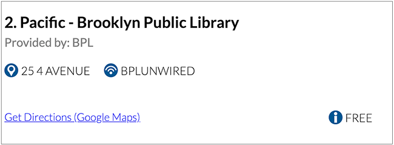

# About

NYC public Wifi hotspot finder. User may enter a NYC-based zip code to find the five closest hotspots based that the inputted zip code. Closest is defined as the closest five hotspots from the centroid of the geographic area covered by the zip code.

Simons Foundation UX Engineer coding challenge.

## How to Run the Project

To run the project, open a bash terminal, change directories to the root directory of the project, and start a local http server. Some possible bash incantations for doing this on OSX include `php -S localhost:8080` (PHP) and `python3 -m http.server 8080` (Python 3). Open your browser and navigate to localhost:8080 (or what ever port you started the local server on).

For local development, follow the development instructions below on how to install and start a dev build.

## How to install for local development

### Requirements
* Node.js verison > 6
* npm or yarn
* Gulp 3

### Instructions
1. Start a terminal and change directories into the root directory of this project.
2. Install gulp and it's dependencies using `npm install` or `yarn install`.
3. From the root directory, run `gulp` in your terminal to start the browser-snyc server. (Browser should launch automatically. If it does not, go to `localhost:3000` in your browser.)

**Note on nyc_zips.json:** This file is generated with the python script in `zip_lat_long_data`. Change directories in `zip_lat_long_data` and run `zipclean.py` with python 3 from the terminal to create the file.

## Design Choices

- **Numbered Markers:** I decided to implement a custom map marker that displays the result number to aid the user with matching map markers with the corresponding result number on the left hand result list. It takes the guesswork out trying to use the location descriptions provided by the data API to identify a specific result marker.

- **Get Directions:** I included a feature where the user can click a link to get directions to a specific hotspot from the results list. I believe that such a feature would be helpful for to users who may want to figure out how to get to the hotspot after learning that it exists.

- **Information On result list items:** In the information displayed on the result list, I decided to include the following – location name, location description, the ssid name, and hotspot type(free or limited). Name and description are important for the user since they form a description of where they can find the hotspot. Showing the hotspot's SSID further helps the user by telling them which connection they should connect their device to. Including hotspot type provides a heads-up to users on whether they will need to paid for a connection. For example, some hotspots, such as those provided by Altice USA are public, but only free for a limited usage period. This is very important for users to know if they are looking for a hotspot to use for an extended period of time.

- **Color and Typography:** I choice a primarily blue plattete to convey a calm feeling that also provides enough contrast to seperate the search bar from the search results. Lato was chosen as the typeface for this project for its good readability at multiple sizes and it's serious-but-friendly appearance. Together, the color scheme and and typeface project a welcoming appearance to users of the app.

## Library/Frameworks Options
If I had the option, I would consider using React to manage the UI for this app. Currently, each time the app receives data from the API, I need to write logic that searches for each DOM node that needs to change states and assign the new markup via `.innerHTML`. I could avoid this using React by writing presentation logic in components that checks on the app's state and react to the data changes. This avoids the need to worry about manually finding and update nodes, which is more error-prone. Additionally React's component-based strategy would allow me to break up the different pieces of the UI, such as the search bar and the result cards, into separate components to get a more organized view of the interface.